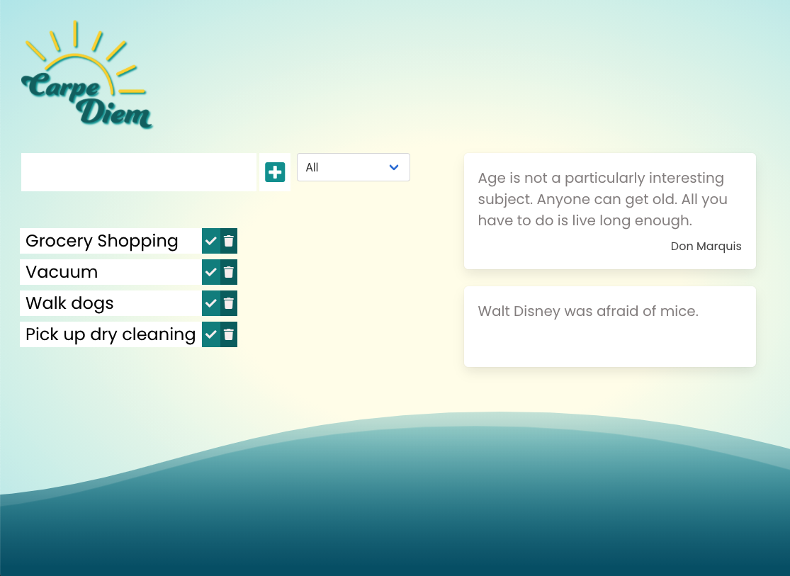
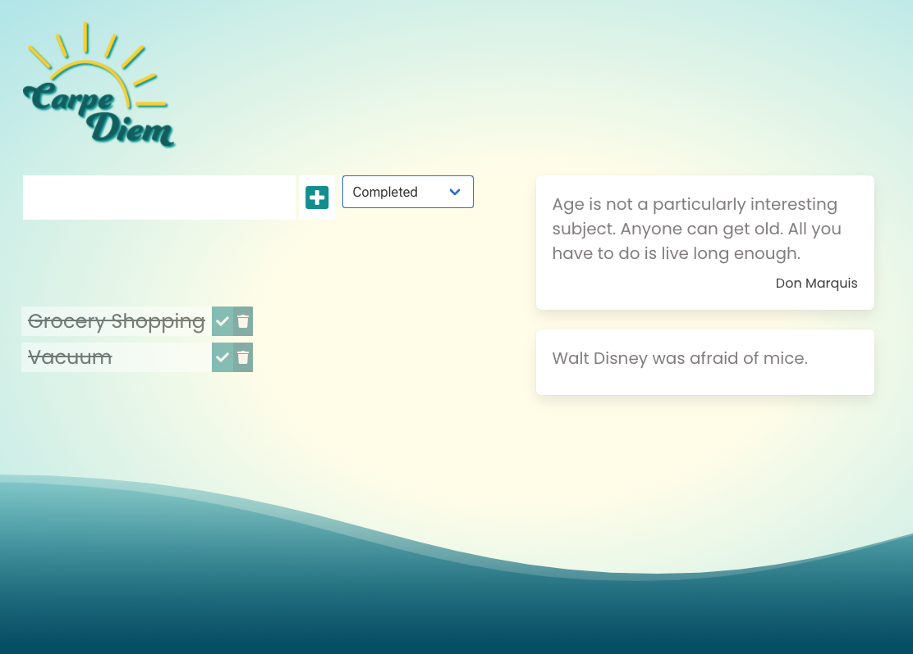

# carpe_diem
This is our first project for University of Oregon coding bootcamp.

## About the Project
**Carpe Diem**
Developed as a vehicle to enhance your overall productivity throughout the day. We start the day by strategizing our daily tasks! Along with a chuckle or two from our “useless,” yet hilarious facts. We also included a quote to make you stop and think.
Completing smaller tasks is proven to provide a sense of accomplishment, enough to propel you forward in getting you closer to your goals. 

## User Story
* As a user, when I open my dashboard..
* I am able to create a task list for the day
* Be able to sort my tasks by completed, to be completed and see all items I created
* I want to be presented with a quote of the day
* I would like to enjoy a fun fact

## ApI Used
Random Useless Facts - https://uselessfacts.jsph.pl
Quote Garden - https://www.quotegarden.com/

## Built With
* HTML
* CSS
* Javascript
* Bulma

## Running instructions
When using this site, we found that Mozilla Firefox was the best browser. If you are using any other browser, you may have to click on the filter button twice to get the list to update.

## Link to Project
https://calliebn.github.io/carpe_diem/

## Authors
Callie Nipper
Goldiluck Rebollido
Josseline Rendon
